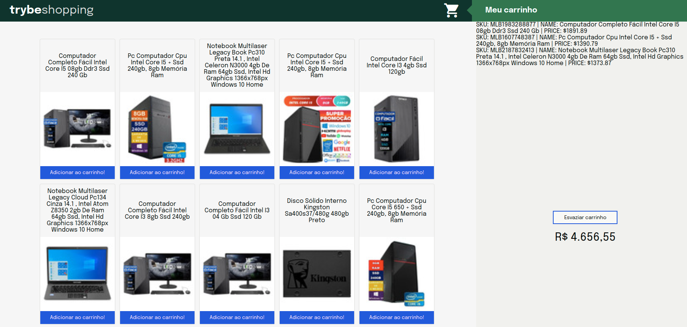

<h1>🛒 Shopping Cart </h1>

<h1>

</h1>

<h3 align="center">
  <a href="https://thierrydrmv.github.io/Shopping-Cart/" target="_blank">Acessar o projeto</a>
</h3>

## 📝 Sobre

O projeto **ShoppingCart** é uma página web que acessa a api do mercado livre e simula um e-commerce para venda de peças de computador, utilizando o localstorage para simular um carrinho de compras. Foi criado durante o módulo de front-end da **Trybe** com o objetivo de colocar em prática todo o conhecimento adquirido.

---

## 🔗 Links

Linkedin: https://www.linkedin.com/in/varela-thierry/

Github: https://github.com/thierrydrmv

Site: https://thierrydrmv.github.io/Shopping-Cart/

---
